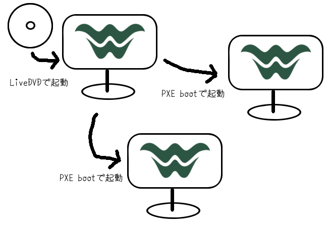

# これは何？

これは Wakame-vdc を手軽に簡単に利用できるようにするための Wakame-vdc LiveDVD を作るプロジェクトです。

## どのぐらい手軽なの？

* LiveDVD を起動するだけでほぼ全自動で Wakame-vdc が利用できます。
* 1台構成はもちろんのこと、複数台マシンを用いて Wakame-vdc 環境を構成することもできます。
* 複数台で構成するのにマシンの台数分の LiveDVD を用意する必要はありません。
* 何台構成になっても用意する LiveDVD は1枚のみ。

# 利用者向けドキュメント

[Wakame-vdc LiveDVD の使い方](wiki/HowtoUseLiveDVD) を参照してください。

# 開発者向けドキュメント

ドキュメント整備中

